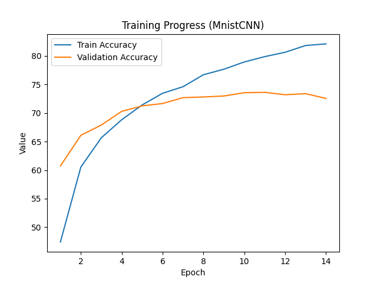
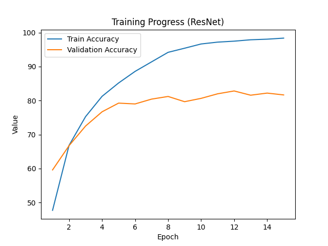

# CIFAR-10 Image classification with Pytorch

## What is the objective?
The first main objective is write a code of validation. So I need to divide dataset and then write a code of train and valid in a one python file.
And the second main objective is comparing different ML models. So make models file directory to organize models.
And the third objective is build a structure of project. 

## CIFAR input shape
input shape : (3 x 32 x 32)
The number 3 means RGB color channel. 

output shape : (10, 1) --> 10 classes

## CNN
convolution 2D
Maxpool 2D
These two filter has same attribute that they has a square filter. But convolution 2D has so many parameters but Maxpool just pick max value in its square filter. And generally maxpool2D squeeze output shape radically more than Conv2D.

## BatchNorm2d
After normalization, y = r x x + b


## Two model
The first model is what we used before at MNIST. Just revise slightly to fit changed datasets CIFAR-10.
And the second model is Resnet-18. Skip connection is important concept of it.


## Runtime error while running train.py
  File "C:\Users\wlskr\Downloads\ChanKyu_Kim-20250522T014702Z-1-001\ChanKyu_Kim\CIFAR\models\MNIST.py", line 21, in forward
    x = F.relu(self.fc1(x))
    RuntimeError: mat1 and mat2 shapes cannot be multiplied (64x4096 and 3136x128)

    So revise code at MNIST.py
    from
    ```code
    self.fc1 = nn.Linear(64 * 7 * 7, 128)
    ```
    to
    ```code
    self.fc1 = nn.Linear(64 * 8 * 8, 128)
    ```

    Since I'm more famil`iar with theoretical concepts, I can quickly spot where things need to be fixed when it comes to matrices or linear transformations.


    -Trying with hyperparameters.
    [Epoch 10] Train Loss: 0.6118
    [Epoch 10] Validation Accuracy: 73.09%
    Model saved to model.pt

    Model seems to be underfitting. It need higher epochs.
    >>> No, I can see that after 10 epochs, train loss sustainly decreases but accuracy just stay around 70%. With 20 epochs, model seems to be overfitted. So just maintain 10 epochs and


## What to do?
Add train loss for checking overfitting --O
test.py --O
Graph --O
early stopping --O 
 save best model --O
Understanding the code nad strucutre of Resnet-18
프로젝트 파일들 구조 그려놓고 설명 하나하나 간단하게.


## Training Progress MnistCNN



> **Note:** Train accuracy starts lower than validation accuracy because it is measured before the model has learned anything, while validation is evaluated after the first epoch.


Early stopping at epoch 14
Best model saved to model_best.pth (Val Acc: 73.63%)
Last model saved to model.pth (Val Acc: 72.56%)
✅ Best model Test Accuracy: 72.44%
✅ Last model Test Accuracy: 72.38%

## Resnet18


Early stopping at epoch 15
Best model saved to model_best.pth (Val Acc: 82.83%)
Last model saved to model.pth (Val Acc: 81.66%)
✅ Best model Test Accuracy: 82.90%
✅ Last model Test Accuracy: 81.99%